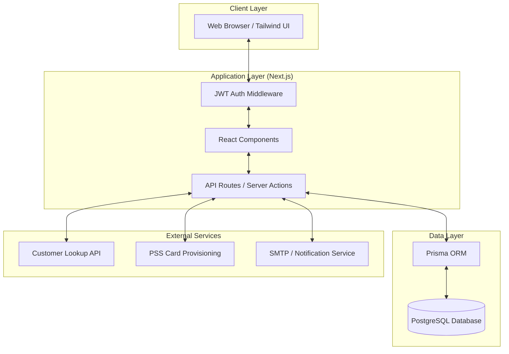
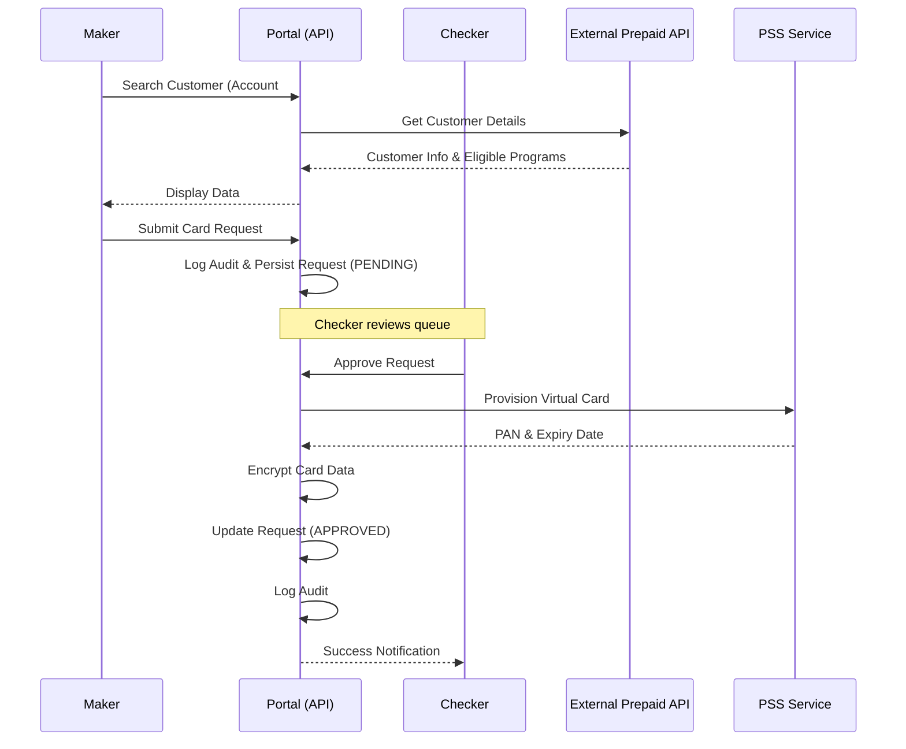
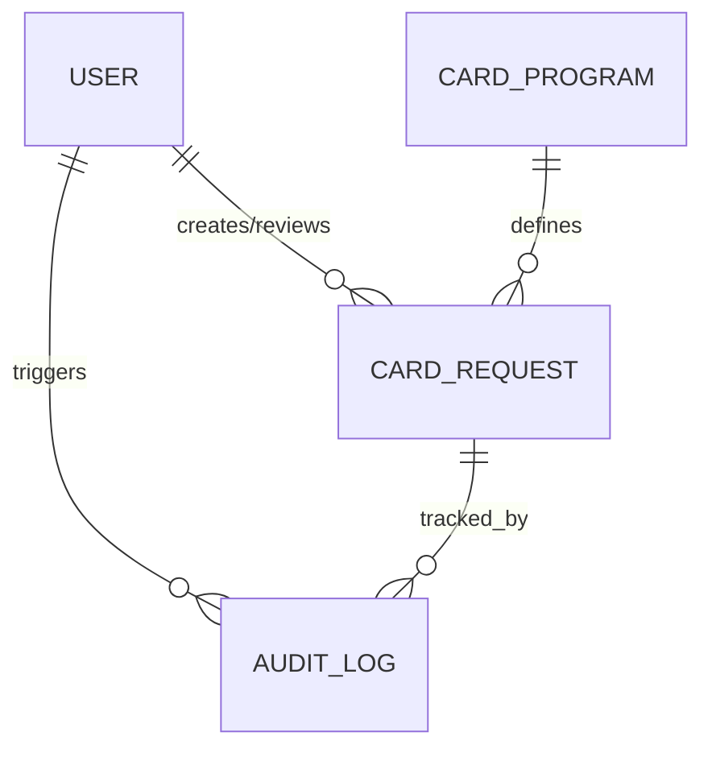

# High Level Design (HLD) - Prepaid Virtual Card Portal

## 1. Introduction

### 1.1 Purpose
The High Level Design (HLD) document provides a conceptual overview of the Prepaid Virtual Card Portal. It describes the system's architecture, core modules, data flow, and external integrations. This document serves as a bridge between the business requirements (BRD) and the detailed technical specifications (LLD).

### 1.2 Scope
The scope covers the end-to-end architecture of the web-based portal, including:
- User authentication and role-based access.
- Card request lifecycle management (Maker/Checker).
- Integration with external banking and provisioning services.
- Audit and administrative oversight.

## 2. System Architecture

The system follows a modern **Monolithic Next.js Architecture** with a decoupled database and external service integrations. It leverages the Next.js App Router for both frontend rendering and backend API logic.

## 3. Core Modules

### 3.1 Authentication & Authorization
- **JWT Session Management**: Uses secure, HttpOnly cookies for session persistence.
- **RBAC**: Implements three primary roles: `SUPER_ADMIN`, `MAKER`, and `CHECKER`.
- **Legacy Auth**: Supports phone-based authentication for external application entry points.

### 3.2 Card Request Management
- **Maker Workflow**: Customer search, program selection, and request submission.
- **Checker Workflow**: Queue management, request review, and approval/rejection logic.
- **Self-Service**: Optional customer-initiated requests via SuperApp integration.

### 3.3 Administration & Audit
- **System Settings**: Configuration for self-service behavior and default assignments.
- **Audit Logs**: Centralized logging of all security-sensitive and business-critical actions.
- **User Management**: Creation and management of internal portal users.

### 3.4 Integration Layer
- **PSS Client**: Secure communication with the card provisioning system using TLS/MTLS.
- **Prepaid Client**: Interface for customer account verification and balance inquiry.

## 4. Operational Flow (Sequence)

### 4.1 Card Request and Provisioning Flow
This diagram illustrates the typical lifecycle of a card request from initiation to successful provisioning.

## 5. Data Architecture (High Level)

The data model is designed to support a robust audit trail and clear separation of duties.

- **Users**: Stores administrative and operational personnel.
- **CardRequests**: The central entity tracking the lifecycle of card issuance.
- **CardPrograms**: Master data for available card products.
- **AuditLogs**: Immutable record of all system events.

## 6. Security Architecture

### 6.1 Data Protection
- **Encryption at Rest**: Sensitive card data (PAN, Expiry) is encrypted using AES-256-GCM before database insertion.
- **No CVV Storage**: CVV is never stored; it is handled in memory only during the provisioning process.

### 6.2 Network Security
- **TLS 1.2+**: All communication between the client, application, and external APIs is encrypted via TLS.
- **Secure Cookies**: HttpOnly, Secure, and SameSite attributes are enforced for all session tokens.

### 6.3 Access Control
- **Role-Based Routing**: Middleware validates JWT claims to restrict access to specific API routes and UI segments.
- **Maker-Checker Constraint**: Logical enforcement ensures that the same user cannot be both Maker and Checker for a single request.

## 7. Infrastructure & Deployment

- **Frontend/Backend**: Next.js application deployed on scalable containerized infrastructure or serverless platforms.
- **Database**: Managed PostgreSQL instance with automated backups and high availability.
- **Integration**: Secure VPN or API Gateway connectivity to external banking host systems.

## 8. Reference
- [BRD.md](file:///c:/Users/Hp/Desktop/VPCard/BRD.md)
- [LLD.md](file:///c:/Users/Hp/Desktop/VPCard/docs/LLD.md)
