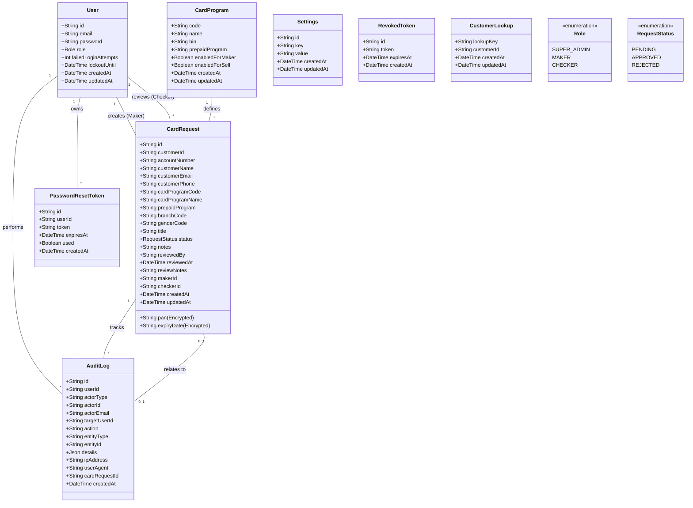
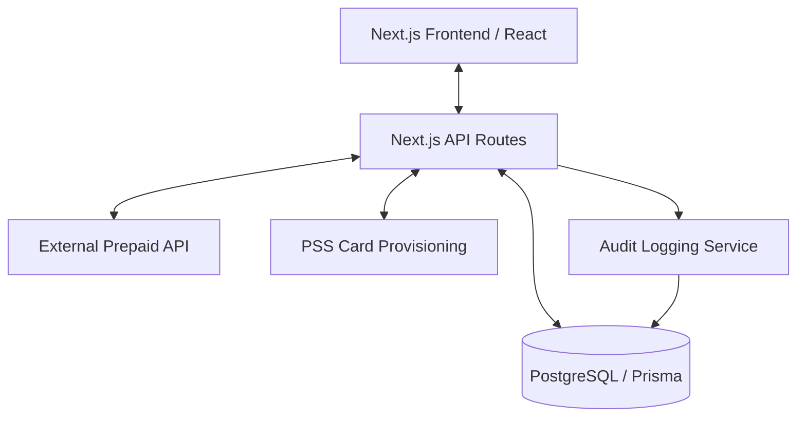

# Low Level Design (LLD) - Prepaid Virtual Card Portal

## 1. Introduction

### 1.1 Purpose of the LLD Document
This document provides a detailed technical design for the Prepaid Virtual Card Portal. It translates the business requirements into a technical specification for developers and stakeholders, covering system architecture, component details, data models, and testing procedures.

#### 1.1.1 In Scope Features
- **User Authentication**: Secure JWT-based login for Super Admin, Maker, and Checker.
- **Role-Based Access Control (RBAC)**: Distinct dashboards and permissions for each role.
- **Customer Search**: Integration with external APIs to fetch customer account details via CID/Account Number.
- **Card Request Workflow**: Maker-initiated requests followed by Checker approval/rejection.
- **Virtual Card Provisioning**: Integration with PSS for real-time card issuance on approval.
- **Audit Logging**: Comprehensive tracking of all sensitive actions and system events.
- **Self-Service Requests**: Customer-initiated card requests via external application integration.
- **Administrative Settings**: Configuration of self-service policies and default checker assignments.

#### 1.1.2 Out-of-Scope
- Physical card manufacturing and shipping.
- Real-time transaction monitoring and fraud detection systems.
- Multi-currency support.
- Native mobile application development.
- Customer KYC/Onboarding (assumed handled by external systems).

#### 1.1.3 Assumptions and Constraints
- **Separation of Duties**: The system must enforce that a Maker cannot approve their own requests.
- **External Dependencies**: Availability of Customer Lookup and PSS APIs is critical for core functionality.
- **Security**: All card data (PAN, Expiry) must be encrypted at rest. CVV must never be stored.
- **Compliance**: The system must adhere to PCI DSS standards for handling cardholder data.

#### 1.1.4 Audience for the Document
- **Development Team**: For implementation guidance.
- **QA/Testing Team**: For designing test cases and verification plans.
- **Project Managers**: For tracking progress against technical milestones.
- **System Architects**: For reviewing design consistency and security.

### 1.2 Significance of The project
The project streamlines the virtual card issuance process, replacing manual or fragmented workflows with a secure, audited digital platform. This reduces operational risk, ensures compliance with financial regulations (including Sharia-compliant practices where applicable), and enhances the customer experience through faster provisioning.

### 1.3 System Design and Analysis

#### 1.3.1 Development Environment
- **Operating System**: Windows/Linux/macOS.
- **Runtime**: Node.js (LTS).
- **Framework**: Next.js 14+ (App Router).
- **Language**: TypeScript.

#### 1.3.2 Development Tools
- **IDE**: Trae / VS Code.
- **Version Control**: Git.
- **Database ORM**: Prisma.
- **Styling**: Tailwind CSS.
- **UI Components**: Shadcn UI / Lucide React.

#### 1.3.3 Testing Procedures
- **Unit Testing**: Jest for business logic and utility functions.
- **Integration Testing**: Testing API routes with mocked external dependencies.
- **End-to-End Testing**: Playwright or Cypress for critical user flows (Login -> Request -> Approval).

### 1.5 Acronyms and Definitions
| Acronym | Definition |
| :--- | :--- |
| **LLD** | Low Level Design |
| **BRD** | Business Requirements Document |
| **PSS** | Prepaid Service System (Card Provisioning) |
| **CID** | Customer Identification Number |
| **PAN** | Primary Account Number (Card Number) |
| **JWT** | JSON Web Token |
| **RBAC** | Role-Based Access Control |
| **AES-256-GCM** | Advanced Encryption Standard with Galois/Counter Mode |

## 2. System functionality Overview
The system operates as a centralized portal for managing the lifecycle of virtual card requests. 
1. **Admin Module**: Manages users (Makers/Checkers) and system-wide configurations.
2. **Maker Module**: Allows staff to search for customers and initiate card requests.
3. **Checker Module**: Provides a queue for reviewing and acting upon pending requests.
4. **Integration Layer**: Handles communication with external banking APIs and PSS for card generation.
5. **Security Layer**: Manages session state, encryption, and audit trails.

## 3. Detailed Design

### 3.1 Use Case Diagram
```mermaid
usecaseDiagram
    actor "Super Admin" as Admin
    actor "Maker" as Maker
    actor "Checker" as Checker
    actor "Customer (Self-Service)" as Customer

    Admin --> (Manage Users)
    Admin --> (Configure Settings)
    Admin --> (View Audit Logs)
    
    Maker --> (Search Customer)
    Maker --> (Create Card Request)
    Maker --> (View Own Requests)
    
    Checker --> (Review Requests)
    Checker --> (Approve Request)
    Checker --> (Reject Request)
    
    Customer --> (Request Card via SuperApp)
    Customer --> (View Card Dashboard)
    
    (Approve Request) ..> (Provision Virtual Card) : include
    (Provision Virtual Card) ..> (PSS Integration) : include
```

### 3.2 Description of the Component

#### 3.2.1 Login Component
- **Purpose**: Authenticates users and establishes secure sessions.
- **Logic**:
    1. User submits email and password.
    2. System validates credentials against the `User` table.
    3. On success: Generates a JWT, sets an HttpOnly cookie, and resets failed attempts.
    4. On failure: Increments `failedLoginAttempts`. If attempts > 5, locks account for 30 minutes.
- **Endpoints**: `POST /api/auth/login`.

#### 3.2.2 Register Admin
- **Purpose**: Allows an existing Super Admin to create new administrative accounts.
- **Logic**:
    1. Verify current user role is `SUPER_ADMIN`.
    2. Validate new admin details (email complexity, password rules).
    3. Hash password and store user with `SUPER_ADMIN` role.
- **Endpoints**: `POST /api/auth/register` (restricted to role: SUPER_ADMIN).

#### 3.2.3 Register Internal User
- **Purpose**: Allows Super Admins to onboard Makers and Checkers.
- **Logic**:
    1. Input: Email, Role (MAKER/CHECKER), temporary password.
    2. System hashes password and creates entry in `User` table.
    3. Logs the creation event in `AuditLog`.
- **Endpoints**: `POST /api/auth/register`.

#### 3.2.4 Add Customer
- **Purpose**: Retrieves and prepares customer data for a card request.
- **Logic**:
    1. Maker enters CID/Account Number.
    2. System queries external Prepaid API.
    3. If found, displays customer name, email, and eligible card programs.
    4. Caches customer mapping in `CustomerLookup` for stability.
- **Endpoints**: `GET /api/customer/search`.

#### 3.2.5 Manage Customer Status
- **Purpose**: Updates the state of a customer's card request through the review lifecycle.
- **Logic**:
    1. Checker selects a PENDING request.
    2. Checker submits decision (APPROVE/REJECT) with notes.
    3. If APPROVED: Calls PSS API, encrypts returned PAN/Expiry, and stores in `CardRequest`.
    4. Updates `CardRequest.status` and logs audit entry.
- **Endpoints**: `PATCH /api/card-requests/[id]`.

### 3.3 Class Diagram


### 3.4 Component Diagram


## 4. Testing

### 4.1 Unit Testing
Focuses on individual functions such as:
- Password hashing and validation.
- JWT generation and verification.
- AES encryption/decryption utilities for card data.
- Input validation logic using Zod schemas.

### 4.1.2 Integration Testing
Verifies interaction between components:
- API endpoints returning correct data from Prisma.
- Middleware correctly protecting routes based on roles.
- Mocking external API responses to test success and failure handling in card issuance.

### 4.1.3 System Testing
End-to-end testing of full workflows:
- **Maker Workflow**: Search -> Select Program -> Submit.
- **Checker Workflow**: Login -> View Queue -> Approve -> Verify Card Data Persistence.
- **Admin Workflow**: Update settings -> Verify self-service behavior change.

### 4.1.4 Acceptance Testing
Verification against BRD requirements:
- Ensuring no duplicate requests can be submitted.
- Verifying audit logs contain all required fields after an action.
- Confirming CVV is never stored in the database.

## 5. Deployment
- **Hosting**: Next.js App Hosting (e.g., Vercel, Firebase, or On-premise Docker).
- **Database**: Managed SQL Server or PostgreSQL instance.
- **Secrets**: Environment variables for DB connection, JWT secrets, and API keys.
- **CI/CD**: Automated pipelines for linting, testing, and deployment to staging/production.

## 6. Reference
- [BRD.md](file:///c:/Users/Hp/Desktop/VPCard/BRD.md)
- [schema.prisma](file:///c:/Users/Hp/Desktop/VPCard/prisma/schema.prisma)
- [blueprint.md](file:///c:/Users/Hp/Desktop/VPCard/docs/blueprint.md)
